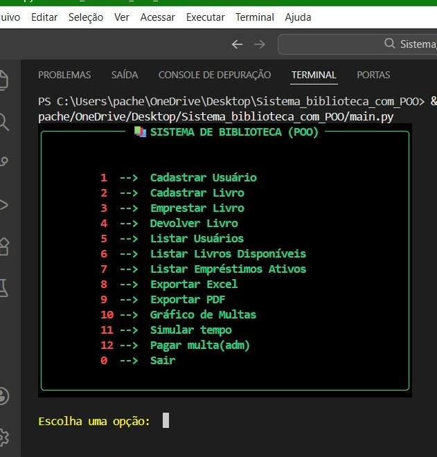
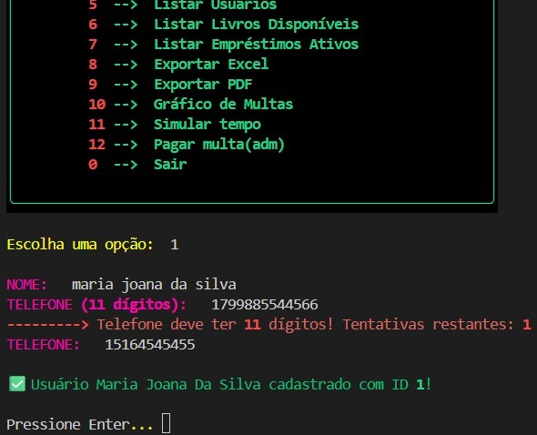
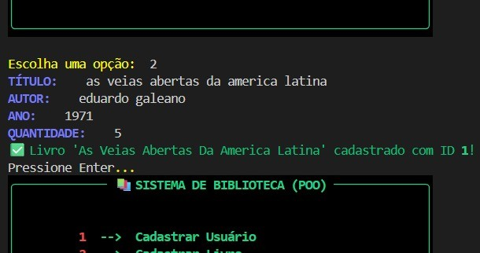
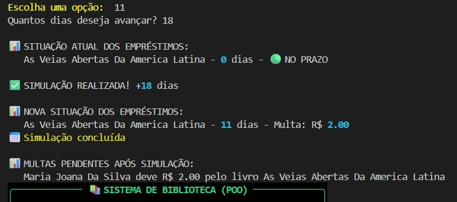
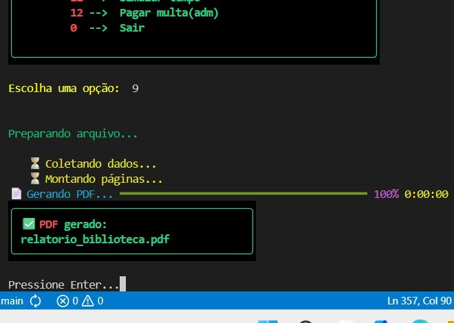
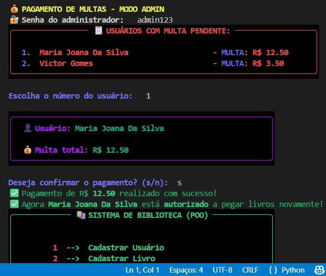
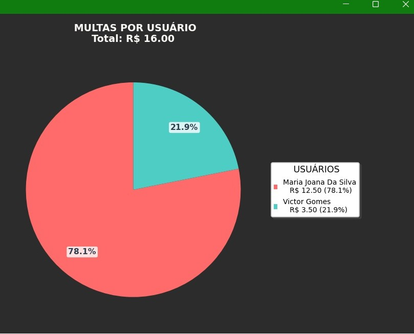
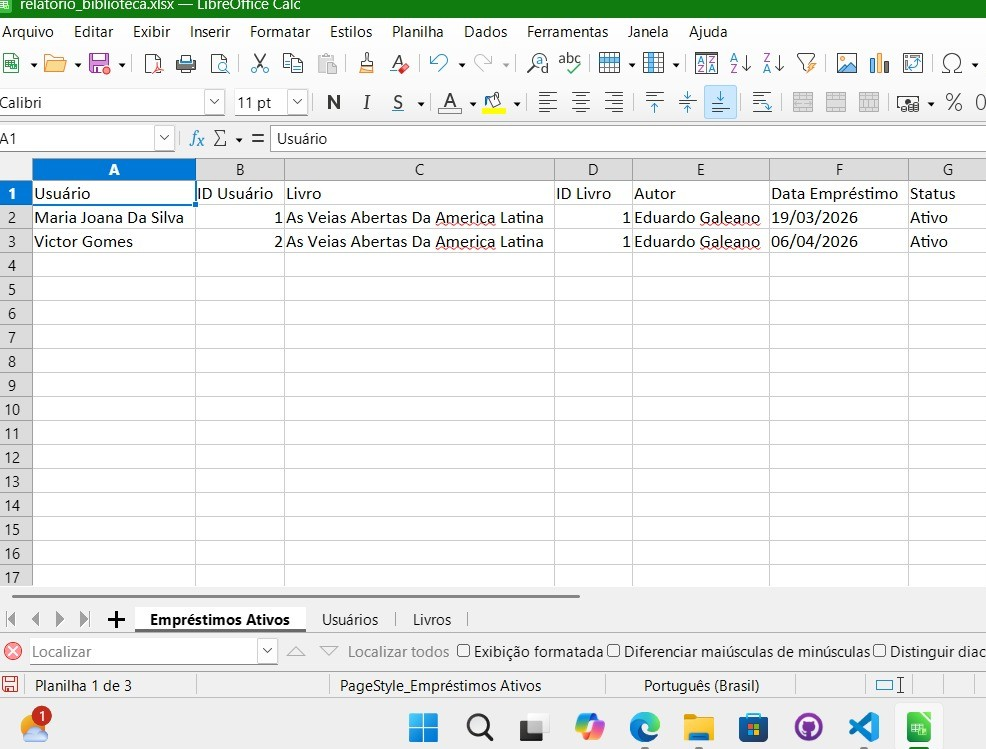
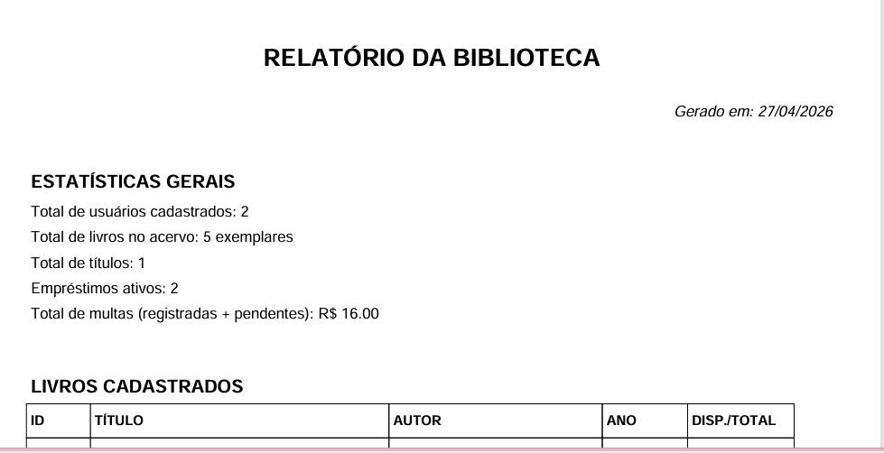
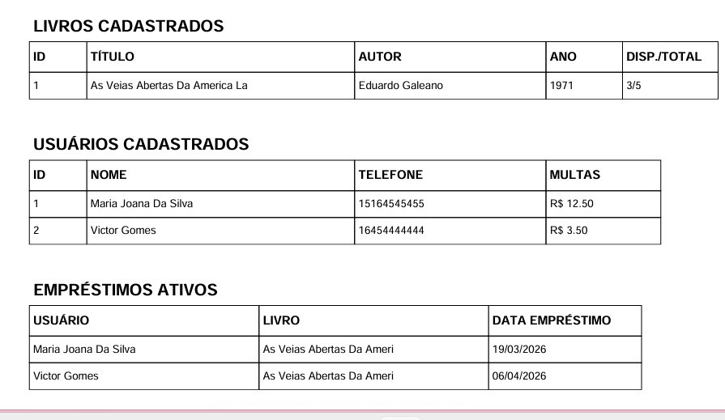

# Sistema_Biblioteca_com_POO 🕮 
--> ✨ Este é meu primeiro contato real com a Programação orientada a objetos. Antes dele, eu havia feito um sistema de biblioteca só com funções soltas, e quis refatorar tudo para entender na prática como encapsulamento, herança, abstração e polimorfismo funcionam de verdade.
  
**Segue o link da primeira biblioteca sem POO -->** [VERSÃO ANTERIOR SEM_POO](https://github.com/MaisaS21/Sistema_Biblioteca)
  

  
  
  
  
   
  
  
  
  

 

### 📌 FUNCIONALIDADES
| Funcionalidade | Descrição |
|----------------|-----------|
| 👤Cadastrar Usuário |--> Registra nome e  telefone com validação de 11 dígitos |
| 📗Cadastrar Livro |--> Registra título, autor, ano e quantidade de exemplares |
| 🔄Emprestar Livro |--> Limita 3 livros por usuário e verifica multas pendentes |
| ↩️Devolver Livro |--> Calcula multa automática de R$ 0,50/dia após 7 dias | 
| 📑Relatórios |--> Listagem de usuários, livros disponíveis e empréstimos ativos |
| 📊Gráfico de Multas |--> Gráfico de pizza com tamanho adaptável e legenda |
| 🔗Exportar Excel |--> Gera planilha com abas indicado detalhes dos empréstimos |
| 🧾Exportar PDF |--> Relatório completo formatado | 
| 💸Pagamento de multas |--> Interface administrativa com senha |
| ⏰Simular tempo |--> Avança datas para testar cálculo de multas |

 

### 🧠Conceitos de POO aplicados
| **Conceito** | **Exemplo no código** | **O que aprendi de verdade** |
|----------|-------------------|----------------------------------|
| **ENCAPSULAMENTO** | Atributos privados(__saldo_multa e livros_emprestados)| Proteger dados diretos do usuário evita inconsistências (ex: ninguém pode zerar uma multa sem passar pelo pagamento)|
| **HERANÇA** | class Livro(ItemBiblioteca)| Economizei linha de código: *ItemBiblioteca* já tinha *título, id e exemplares* |
| **ABSTRAÇÃO** | class ItemBiblioteca(ABC) com método @abstractmethod| garante que qualquer item futuro (ex: 'Audiolivro', 'Ebook') implemente '*calcular_multa()*'|
| **POLIMORFISMO** | Método calcular_multa() implementado de forma diferente por classe| Hoje só tenho 'Livro', mas o sistema já está preparado para expansão|

 

### 🔧 Estrutura do Projeto (arquitetura limpa)
Sistema_Biblioteca_com_POO/  
|  
|--main.py                                   # Interface principal e fluxo do sistema  
|--modelos.py                                # Classes( Usuario, Livro, Emprestimo, ItemBiblioteca. Biblioteca)  
|--utilidades.py                             # Funções auxiliares (validações, formatação)  
|--exportadores.py                           # Geração de Excel e PDF  
|--relatorio_graficp_multas.py               # Gráfico de pizza com (matplotlib)  
|--requirements.txt                          # Todas as Bibliotecas utilizadas  
|  
|--LICENCE                                   # MIT License  

 
 

(  📌 *Além disso, o dados ficam salvos em um arquivo json gerado automaticamente, ou seja, persistência dos dados* )

 
 

-->    **SEGUE ABAIXO O EXEMPLO DE USO (ENTRADA -> SAÍDA) E TAMBÉM PRINTS DO FUNCIONAMENTO**  
|    (**OBS**⚠️: Meu notebook é um ASUS com recursos bem limitados. Por isso, o sistema roda de forma mais lenta, então para não deixar exemplo visual do sistema, trouxe aqui uma sequencia dele sendoe executado)

 

**Explicação breve e dados utilizadas : **  

1º - Primeiro passo foi realizar um cadastro, errei o telefone de propósito para simular a validação, depois, cadastrei +1 usuário;  
2º - Cadastrei um livro com 5 exemplares;  
3º - Emprestei 1 exemplar para o usuário 1 e simulei 16 dias com o livro;  
4º - Emprestei 1 exemplar para o usuário 2 e simulei o tempo com 32 dias e depois mais 22;  
5º - Fiz a devolução do empréstimo do usuário 1 com R$ 28,00 de multa total;  
6º - Atualizei que foi paga a multa;  
 

**USUÁRIO 1** --> Nome: Maria Joaquina Silva;  
**USUÁRIO 2** --> Nome: Victor Luan Silva Gomes;  
**LIVRO CADASTRADO** --> A negação do brasil negro com 5 exemplares;  

 

* Menu principal com 13 opções :
  
  
 
* Cadastro de usuário com validação de telefone (11 dígitos) (Passo 1) :
 

  
 
* Cadastro de livro com titulo, autor, ano de publicação e quantidade de exemplares (Passo 2) :
 

  
 
* Após o empréstimo o usuário 'recebe' um comprovante (Passo 3):
 

  
 
* Exemplo de simulação de tempo (Passo 3 e 4):
 

  
 
* Comprovante de devolução de livro com multa (Passo 5):
 

  
 
* Barra de progresso de 'salvando o arquivo' para PDF e Excel :
 

  
 
* Interface do administrador (registrando o pagamento de uma multa)(Passo 6) :
 

  
 
* Gráfico de multas :
 

  
 
* Arquivo excel :
 

  
 
* Primeira parte do PDF (estatistica geral):
 

  
 
* Segunda parte do PDF (Multas) :
 

  

 
 

---

 

### 💭 Pontos que quero melhorar futuramente  
- Adicionar buscar por título do livro  
- Permitir reservar o livro que está emprestado  
- Migrar para SQLite quando o sistema 'crescer'  
- Criar interface gráfica com PySide6 / PyQt6  

---
 
📚 Base do conhecimento adquirido: Curso em Vídeo (Gustavo Guanabara)

